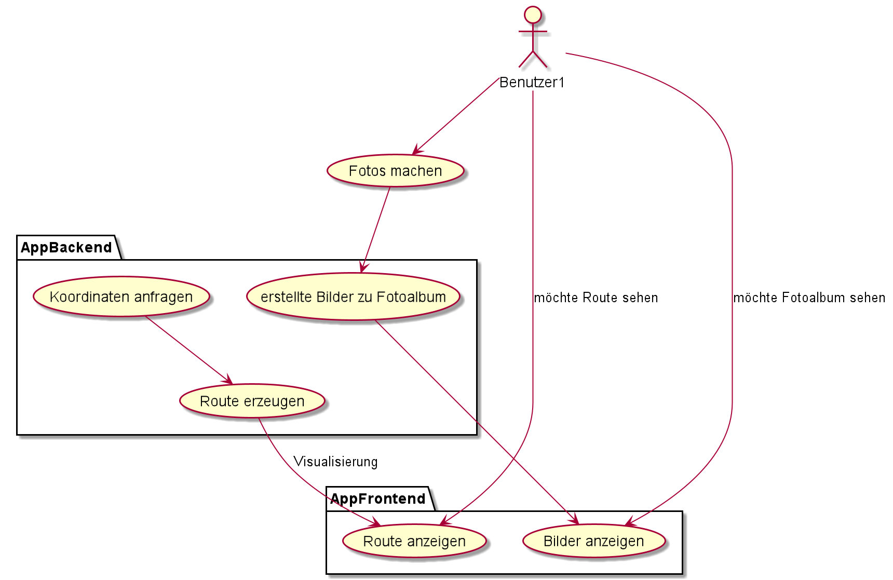

== 1. Pflichtenheft

=== 1.1 Ausgangssituation

Das unabhängige Familienunternehmen namens Ostwind welches
moderne Wind- und Solarparks europaweit projektiert und errichtet
hat Ihre Stammorte in Frankreich und Deutschland verteilt.

In der Vergangenheit haben sie schon 603 Windkraftanlagen mit 1085
Megawatt Leistung geplant, gebaut und ans Netz gebracht. Energiekonsumenten welche
Wert auf ökonomische Energie legen, können sich diesen Wunsch bei Ostwind
erfüllen lassen.

=== 1.2 Istzustand

In der Vergangenheit kam es öfters vor, dass durch motivierte
Wanderer die Vegetation verschmutzt und zerstört wurde,
indem sie unmarkierte/unoffizielle Wege nahmen.
Um die Bäume und das Umfeld in solchen Gebieten in Zukunft
zu schützen wird eine Software entwickelt, die als Profit
für die Einwohner wegen des darauffolgenden Tourismus dient.

=== 1.3 Problemstellung

Um die Route des zurückgelegten Weges visualisieren zu können, werden die Koordinatenpunkte
der zu bewandernden Pfade bei einer Person der Organisation angefragt.

=== 1.4 Aufgabenstellung

* Vorbereitungen
** Koordinaten beantragen
** Landkarte vorbereiten mittels erhaltenen Koordinaten

* Dokumentation
** README.md
** asciidoctor
** use-case diagram
** Datenmodell (ERD)

==== Funktionale Anforderungen

//==== Nichtfunktionale Anforderungen (NFA)

=== Ziele

Unterstützung des Umweltschutzes und betroffene Bewohner die davon profitieren.

//=== Mengengerüst
//=== Rahmenbedingungen
//zB Vorgaben vom Auftraggeber

//== Entwurf "Wie mache ich es"
//=== Systemarchitektur
//=== ...

//== Projekthandbuch "Organisatorische Rahmenbedingungen"
=== Meilensteine

[cols="1,1", options="header"]
|===
| Meilenstein
| Datum

| Brain Storming
| 2.10.2020

| Projekt-Auftrag
| 29.10.2020

| Pflichtenheft
| --

| Vorbereitungen arrangiert
| --

|===

=== GANTT-Diagramm

//* link:minutes-of-meeting.html[Protokollvorlage]
//* link:demo.html[Demo]